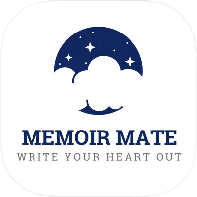

  <h3>앱 안정성과 완성도를 집요하게 고민하는 iOS 개발자 정정욱입니다. 😸</h3>

---

## About Me
- 사용자에게 보이는 기능 구현을 넘어, 안정적인 인증 흐름 · 비동기 처리 · 네트워크 구조 개선에 집중합니다.
- iOS 앱의 성능, 구조, 유지보수성을 꾸준히 고민하며 더 나은 사용자 경험으로 연결해 왔습니다.
- 혼자 잘 만드는 개발자보다, 함께 일하고 싶은 개발자가 되는 것을 중요하게 생각합니다.

## Projects

| Icon | Project | Summary | Link |
|---|---|---|---|
|  | **D-Play** | 음악 큐레이션 SNS | [GitHub](https://github.com/DIGGING-PLAY/DPlay-iOS) · [App Store](https://apps.apple.com/kr/app/%EB%94%94%ED%94%8C%EB%A0%88%EC%9D%B4-dplay/id6758450197) |
|  | **YahooStocksKit** | 주식 데이터 SPM | [GitHub](https://github.com/jeonguk29/YahooStocksKit) |
|  | **Memento** | AI 일정 관리 앱 | [GitHub](https://github.com/dev-memento/memento-iOS) |
|  | **SnapFit** | 스냅 작가 매칭 앱 | [GitHub](https://github.com/Central-MakeUs/SnapFit-iOS) · [App Store](https://apps.apple.com/kr/app/snapfit/id6642695481) |
|  | **MEMOIR MATE** | 일상 기록 앱 | [GitHub](https://github.com/jeonguk29/Memoir-Mate) · [App Store](https://apps.apple.com/kr/app/memoirmate/id6474548626) |

## Experience
- **2026.02 ~ ing** 현직자 중심 IT 동아리 **Mash-Up iOS Team**
- **2024.09 ~ 2025.07** 전국 최대 규모 대학생 연합 IT 창업 동아리 **SOPT iOS 35기 YB / 36기 OB 수료**
- **2024.05 ~ 2024.09** 수익형 앱 런칭 동아리 **CMC 15기 iOS Challenger**
- **2023.09 ~ 2024.02** **멋쟁이사자처럼 앱 스쿨 iOS 3기**

## Award
- **2024** 멋쟁이사자처럼 앱 스쿨 iOS 3기 **최종 대상(1위)**
- **2023** 전공연계 SDGs 실천 챌린지 **프로젝트 우수상**

## GitHub Stats

